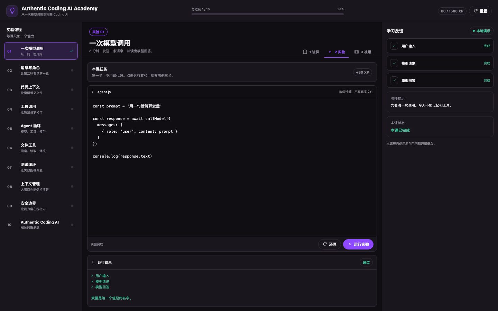
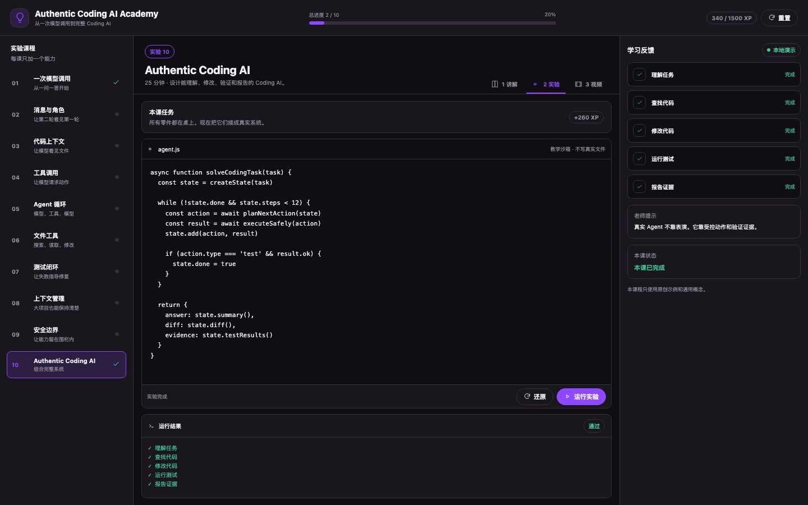

# Authentic Coding AI Academy

**English** · [简体中文](docs/i18n/README.zh-CN.md) · [हिन्दी](docs/i18n/README.hi.md) · [Español](docs/i18n/README.es.md) · [Français](docs/i18n/README.fr.md) · [বাংলা](docs/i18n/README.bn.md) · [Português](docs/i18n/README.pt.md) · [Русский](docs/i18n/README.ru.md) · [Deutsch](docs/i18n/README.de.md) · [日本語](docs/i18n/README.ja.md) · [한국어](docs/i18n/README.ko.md) · [Italiano](docs/i18n/README.it.md)

An interactive course that teaches you to build a coding AI step by step.

Start with one model call. Then add message history, code context, tools, an agent loop, file edits, tests, safety limits, and final evidence.

## Preview






## Install in KiroCrew

KiroCrew installs external apps from a local folder containing `app.json`. Clone this repository first, then install that folder.

### macOS or Linux

```bash
git clone https://github.com/bolichen97/authentic-coding-ai-academy.git
cd authentic-coding-ai-academy
kirocrew app install "$PWD"
kirocrew restart
```

### Windows PowerShell

```powershell
git clone https://github.com/bolichen97/authentic-coding-ai-academy.git
Set-Location authentic-coding-ai-academy
kirocrew app install (Get-Location).Path
kirocrew restart
```

After KiroCrew restarts:

1. Open a fresh dashboard session.
2. Find **Coding AI Academy** in the sidebar.
3. Open lesson 1, select **2 实验 (Lab)**, then click **运行实验 (Run Lab)**.

If the app does not appear, refresh the dashboard after the restart.

## What you will build

The ten lessons grow one small project:

1. One model call
2. Messages and roles
3. Code context
4. Tool calls
5. The agent loop
6. File tools
7. The test loop
8. Context control
9. Safety limits
10. Authentic Coding AI

Every lesson includes a short explanation, three new terms, a quiz, editable code, a lab, instant feedback, and a short video.

Course progress stays in your browser.

## Full walkthrough videos

Each video takes a regular user through the complete ten-lesson flow. The walkthrough starts with one model call and ends with code search, editing, tests, and verified evidence.

- [English](https://github.com/bolichen97/authentic-coding-ai-academy/releases/download/v0.2.0/authentic-coding-ai-academy-en.mp4)
- [简体中文](https://github.com/bolichen97/authentic-coding-ai-academy/releases/download/v0.2.0/authentic-coding-ai-academy-zh-CN.mp4)
- [हिन्दी](https://github.com/bolichen97/authentic-coding-ai-academy/releases/download/v0.2.0/authentic-coding-ai-academy-hi.mp4)
- [Español](https://github.com/bolichen97/authentic-coding-ai-academy/releases/download/v0.2.0/authentic-coding-ai-academy-es.mp4)
- [Français](https://github.com/bolichen97/authentic-coding-ai-academy/releases/download/v0.2.0/authentic-coding-ai-academy-fr.mp4)
- [বাংলা](https://github.com/bolichen97/authentic-coding-ai-academy/releases/download/v0.2.0/authentic-coding-ai-academy-bn.mp4)
- [Português](https://github.com/bolichen97/authentic-coding-ai-academy/releases/download/v0.2.0/authentic-coding-ai-academy-pt.mp4)
- [Русский](https://github.com/bolichen97/authentic-coding-ai-academy/releases/download/v0.2.0/authentic-coding-ai-academy-ru.mp4)
- [Deutsch](https://github.com/bolichen97/authentic-coding-ai-academy/releases/download/v0.2.0/authentic-coding-ai-academy-de.mp4)
- [日本語](https://github.com/bolichen97/authentic-coding-ai-academy/releases/download/v0.2.0/authentic-coding-ai-academy-ja.mp4)
- [한국어](https://github.com/bolichen97/authentic-coding-ai-academy/releases/download/v0.2.0/authentic-coding-ai-academy-ko.mp4)
- [Italiano](https://github.com/bolichen97/authentic-coding-ai-academy/releases/download/v0.2.0/authentic-coding-ai-academy-it.mp4)

`en-XA` is a development pseudolocale, not a user language, so it has no voiceover.

## Local preview

```bash
python3 -m http.server 7413 --bind 127.0.0.1
```

Open [http://127.0.0.1:7413/preview.html](http://127.0.0.1:7413/preview.html).

The preview loads pinned React files from a public CDN. The installed KiroCrew app uses React provided by KiroCrew.

## Build the media

Voiceovers use local macOS voices. Narration text is not sent to a speech service.

```bash
cd video
node build-local-narration.mjs
python3 record.py
npm run check
npm run render
npm run voiceovers
```

Generated files stay out of Git:

```text
video/renders/authentic-coding-ai-academy.mp4
video/renders/authentic-coding-ai-academy-<language>.mp4
```

## Validation

```bash
node --check ui/academy.mjs
node --check ui/course-data.mjs
node --check video/build-local-narration.mjs
node --check video/build-all-voiceovers.mjs
python3 -m py_compile video/record.py
cd video && npm run check
```

## Privacy

This project contains original teaching material and general technical ideas only.

It contains no private source code, private architecture, internal links, private commit data, credentials, account data, or background jobs.

## Project structure

```text
app.json
preview.html
ui/
  academy.mjs
  course-data.mjs
  icon.svg
video/
  script.json
  script.<language>.json
  brand.json
  build-local-narration.mjs
  build-all-voiceovers.mjs
  build-english-video.mjs
  capture-screenshots.py
  record.py
  package.json
```
