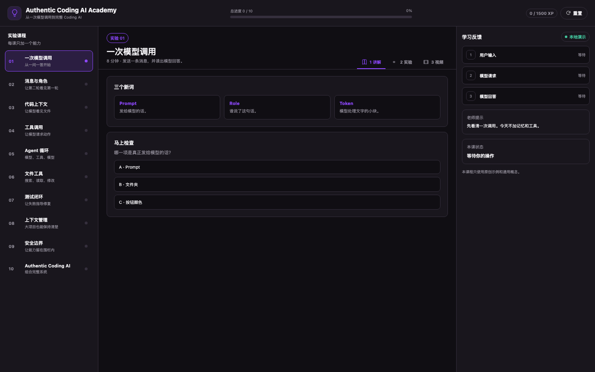

# Authentic Coding AI Academy

[English](../../README.md) · [简体中文](README.zh-CN.md) · [हिन्दी](README.hi.md) · [Español](README.es.md) · [Français](README.fr.md) · [বাংলা](README.bn.md) · [Português](README.pt.md) · **Русский** · [Deutsch](README.de.md) · [日本語](README.ja.md) · [한국어](README.ko.md) · [Italiano](README.it.md)

Интерактивный курс, который начинается с одного вызова модели и заканчивается AI, способным искать, читать, менять и проверять код.

[](https://github.com/bolichen97/authentic-coding-ai-academy/releases/download/v0.2.0/authentic-coding-ai-academy-ru.mp4)

Обзор воспроизводится прямо на GitHub. Нажмите, чтобы открыть полное русское видео.



## Установка в KiroCrew

KiroCrew устанавливает внешние приложения из локальной папки с файлом `app.json`. Сначала клонируйте репозиторий, затем установите эту папку.

### macOS или Linux

```bash
git clone https://github.com/bolichen97/authentic-coding-ai-academy.git
cd authentic-coding-ai-academy
kirocrew app install "$PWD"
kirocrew restart
```

### Windows PowerShell

```powershell
git clone https://github.com/bolichen97/authentic-coding-ai-academy.git
Set-Location authentic-coding-ai-academy
kirocrew app install (Get-Location).Path
kirocrew restart
```

После перезапуска:

1. Откройте новую сессию Dashboard.
2. Найдите **Coding AI Academy** на боковой панели.
3. Откройте первый урок и запустите лабораторию.

Если приложение не появилось, обновите Dashboard после перезапуска.

## Курс

Десять уроков добавляют историю, контекст кода, инструменты, цикл агента, правки файлов, тесты, управление контекстом и границы безопасности. В каждом уроке есть объяснение, вопрос, редактируемый код, лаборатория и быстрый результат.

## Полное видео

[Смотреть русский walkthrough](https://github.com/bolichen97/authentic-coding-ai-academy/releases/download/v0.2.0/authentic-coding-ai-academy-ru.mp4)

[Смотреть все 12 языков](https://github.com/bolichen97/authentic-coding-ai-academy/releases/tag/v0.2.0)

## Локальный просмотр

```bash
python3 -m http.server 7413 --bind 127.0.0.1
```

Откройте [http://127.0.0.1:7413/preview.html](http://127.0.0.1:7413/preview.html).

## Приватность

Проект содержит только оригинальные учебные материалы и общие идеи. В нём нет закрытого кода, внутренних ссылок, учётных данных, данных аккаунта или фоновых задач.
